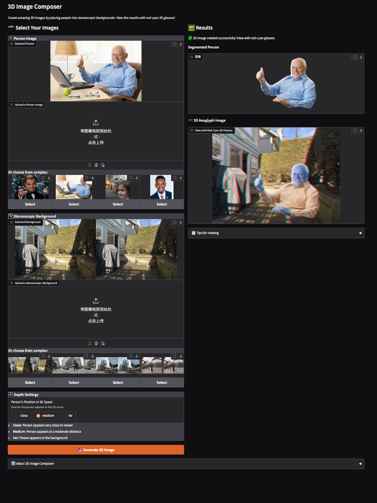
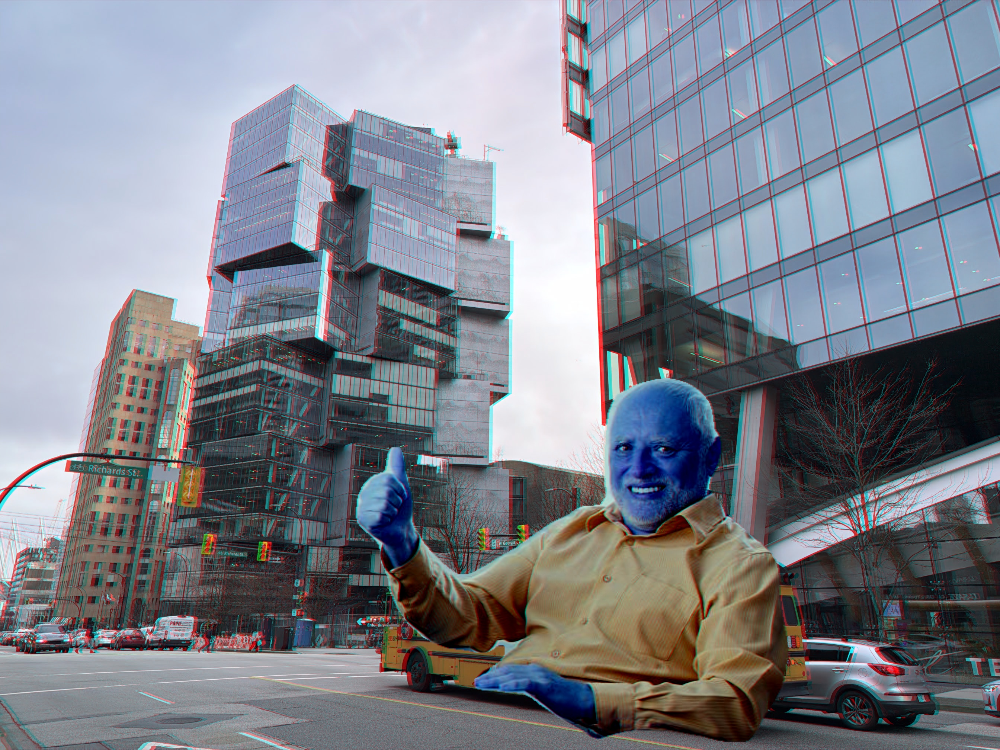

# 3D Image Composer Lab Report

## Introduction

The 3D Image Composer project sits at the intersection of computer vision, image processing, and human perception. By creating a tool that generates three-dimensional visual experiences, this project explores how we can manipulate images to create realistic depth perception. The main goals of this lab were to:

1. Extract people from images using semantic segmentation
2. Place the segmented people into stereoscopic background images
3. Control the perceived depth of the inserted people
4. Generate anaglyph images viewable with red-cyan glasses
5. Build an intuitive application that lets users create their own 3D compositions

I'm happy to report that all objectives were successfully achieved, resulting in a functional application that demonstrates fundamental principles of stereoscopic image processing while remaining accessible to users without technical expertise.

## Methodology

### Image Segmentation

For extracting people from images, I implemented a solution using DeepLabV3:

1. **Model Selection**: I chose DeepLabV3 with a ResNet50 backbone pre-trained on the COCO dataset. This model performs exceptionally well at person segmentation across various poses, clothing types, and lighting conditions.

2. **Implementation**: The segmentation process in the `segment_person` function:
   - Preprocesses the input image
   - Passes it through the DeepLabV3 model
   - Extracts the person mask (class ID 15 in COCO)
   - Applies morphological operations to clean the mask
   - Creates an RGBA image with transparency where no person is detected

3. **Mask Refinement**: I applied closing and opening operations with a 5×5 kernel to remove small holes and noise from the mask without sacrificing edge detail.

### Stereoscopic Image Processing

To incorporate segmented people into stereoscopic images:

1. **Stereo Pair Handling**: The `load_stereo_pair` function splits side-by-side stereoscopic images into separate left and right views.

2. **Person Insertion with Depth**: The core algorithm in `insert_person_with_depth`:
   - Resizes the person proportionally to the background
   - Calculates horizontal displacement (disparity) based on desired depth
   - Positions the person in both left and right images with appropriate offsets
   - Blends the person into the background using alpha compositing

3. **Depth Configuration**: I implemented three distinct depth levels:
   - **Close**: Large disparity (40 pixels) creates a pop-out effect
   - **Medium**: Moderate disparity (20 pixels) for balanced depth
   - **Far**: Small disparity (5 pixels) positions the person deeper in the scene

This approach creates a convincing depth effect while maintaining comfortable viewing without excessive eye strain.

### Anaglyph Creation

The conversion to anaglyph format happens in the `create_anaglyph` function:

1. **Channel Extraction**: The function extracts the red channel from the left image and the green and blue channels from the right image.

2. **Color Space Management**: The implementation carefully handles color space conversions between BGR and RGB to ensure correct channel mapping.

3. **Output Format**: The final anaglyph is returned in BGR format for compatibility with OpenCV functions.

### Gradio Application Development

The interactive application uses Gradio with a focus on usability:

1. **Interface Design**: I created a single-page layout with inputs on the left and results on the right, making the workflow intuitive and reducing cognitive load.

2. **User Input Options**: The app allows users to:
   - Upload their own person images or select from samples
   - Upload their own stereoscopic backgrounds or select from samples
   - Choose the depth level (close, medium, far)
   - Adjust position and size of the person in the scene
   - Toggle color adaptation between person and background

3. **Output Display**: Results appear in real-time, showing:
   - The segmented person with transparency
   - The final anaglyph image for viewing with red-cyan glasses

4. **Error Handling**: Comprehensive error checking provides friendly feedback to guide users through the process.

## Results
[Gradio Link](https://huggingface.co/spaces/zanegu/3D-Image-Composer)
<figure>
    
    <figcaption>Gradio interface</figcaption>
</figure>

The 3D Image Composer successfully creates convincing 3D images by combining segmented people with stereoscopic backgrounds:

### Segmentation Results

The DeepLabV3 model produces clean segmentations, effectively removing backgrounds while preserving details like hair and clothing edges. The morphological operations successfully eliminate small artifacts without degrading segmentation quality.

### Depth Manipulation

<figure>
    
    <figcaption>Close option</figcaption>
</figure>
<figure>
    
    <figcaption>Far option</figcaption>
</figure>

The three depth levels create distinctly different perceptions when viewed with red-cyan glasses:

- **Close**: Creates a dramatic pop-out effect where the person appears to be in front of the screen
- **Medium**: Places the person at a natural middle-ground depth that integrates well with most scenes
- **Far**: Situates the person deeper in the scene, making them appear part of the background environment

### Anaglyph Quality

The anaglyph images display proper color separation and depth when viewed with red-cyan glasses. The channel combination method balances depth perception and color representation, though some color distortion is unavoidable due to the nature of anaglyph imaging.

### User Interface

The app's layout provides a streamlined experience with:
- Side-by-side arrangement of inputs and outputs
- Sample galleries for quick experimentation
- Clear section headings and visual organization
- Status messages providing feedback on processing and potential errors

## Discussion

### Challenges and Solutions

#### 1. Segmentation Quality

**Challenge**: Initial segmentation results sometimes included parts of the background or missed fine details like hair or fingers.

**Solution**: Implementing morphological operations with carefully tuned kernel sizes helped find the optimal balance between noise removal and detail preservation. For future improvements, more advanced techniques like conditional random fields could further enhance segmentation quality.

#### 2. Depth Perception Tuning

**Challenge**: Finding appropriate disparity values required careful tuning to avoid eye strain while maintaining convincing depth effects.

**Solution**: Through iterative testing, I determined that the current settings (5, 20, and 40 pixels) provide a good balance for typical viewing distances of a computer screen.

#### 3. User Interface Design

**Challenge**: Creating an intuitive interface that non-technical users could navigate without confusion was more difficult than anticipated.

**Solution**: I focused on a step-by-step approach with clear visual guidance, sample images for immediate testing, and informative feedback messages. User testing helped identify pain points in the workflow that weren't obvious during development, leading to improved layout and clearer instructions.

#### 4. Color Adaptation

**Challenge**: People extracted from one image often looked unnatural when placed into backgrounds with different lighting conditions.

**Solution**: I implemented an optional color adaptation feature that analyzes and matches lighting conditions between the person and background, helping create more natural-looking compositions.

## Conclusion

The app demonstrates image segmentation, stereoscopic imaging, and anaglyph creation principles, it also provides an accessible way for users to experiment with 3D image composition requiring only red-cyan glasses.

### Future Work

Several promising enhancements could be explored:

1. **Multiple Object Insertion**: Extending the application to support multiple segmented objects at different depths would create more complex and interesting scenes. This would require developing a layering system to manage object overlap and relative positioning.

2. **Advanced Background Adaptation**: Enhancing the color correction to better match lighting and shadows between the person and background would further improve realism.

3. **Dynamic Pose Adaptation**: Developing capability to adjust the person's pose to better match the scene perspective would create more natural compositions.