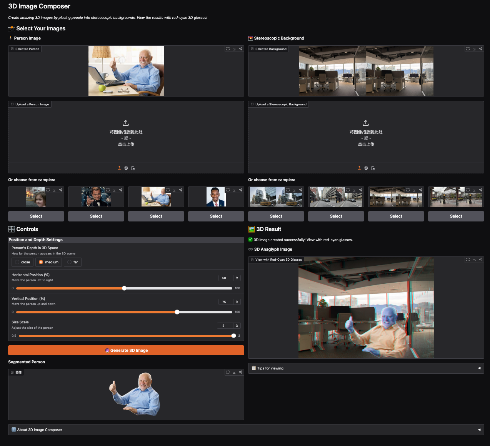

# 3D Image Composer Lab Report

## Introduction

The 3D Image Composer project explores the intersection of computer vision, image processing, and human perception through the creation of a tool that generates three-dimensional visual experiences. The main objectives of this lab were to:

1. Extract a person from an image using semantic segmentation techniques
2. Insert the segmented person into stereoscopic background images
3. Manipulate the perceived depth of the inserted person
4. Convert the resulting stereoscopic pairs into anaglyph images viewable with red-cyan glasses
5. Create an interactive application that allows users to generate their own 3D compositions

This project successfully accomplished all these objectives, resulting in a functional, user-friendly application that demonstrates core principles of stereoscopic image processing and depth perception.

## Methodology

### Image Segmentation

For the segmentation of people from images, I implemented a solution using DeepLabV3, a deep learning model for semantic segmentation:

1. **Model Selection**: I utilized DeepLabV3 with a ResNet50 backbone pre-trained on the COCO dataset with VOC annotations. This model was chosen for its excellent performance in person segmentation tasks and its ability to accurately detect human figures in varied poses and lighting conditions.

2. **Implementation**: The segmentation process was implemented in the `segment_person` function in the `segmentation.py` module. The function performs the following steps:
   - Loads and preprocesses the input image
   - Passes the image through the DeepLabV3 model
   - Extracts the person mask from the segmentation results (class ID 15 in COCO)
   - Applies morphological operations to clean up the mask
   - Creates a 4-channel RGBA image with transparency where no person is detected

3. **Mask Refinement**: To improve the quality of the segmentation, I applied morphological operations (closing and opening) with a 5×5 kernel to remove small holes and noise from the mask.

### Stereoscopic Image Processing

To incorporate the segmented person into stereoscopic images:

1. **Stereo Pair Handling**: I developed the `load_stereo_pair` function in the `stereo_processing.py` module to split side-by-side stereoscopic images into separate left and right views.

2. **Person Insertion with Depth**: The core algorithm for adding the person to the stereoscopic images is in the `insert_person_with_depth` function, which:
   - Resizes the person to a proportionate size relative to the background (approximately 2/3 of background height)
   - Calculates the appropriate horizontal displacement (disparity) based on the desired depth level
   - Positions the person in both left and right images with corresponding offsets
   - Blends the person into the background using alpha compositing

3. **Depth Level Configuration**: I implemented three distinct depth levels:
   - **Close**: Large disparity (40 pixels) to create the illusion that the person is near the viewer
   - **Medium**: Moderate disparity (20 pixels) for a balanced depth effect
   - **Far**: Small disparity (5 pixels) to position the person deeper in the scene

This approach ensures that the depth effect is convincing while maintaining a comfortable viewing experience without excessive parallax that could cause eye strain.

### Anaglyph Creation

The conversion of stereoscopic pairs into anaglyph images was implemented in the `create_anaglyph` function in the `anaglyph.py` module:

1. **Channel Extraction and Combination**: The function extracts the red channel from the left image and the green and blue channels from the right image.

2. **Color Space Handling**: The implementation carefully manages color space conversions between BGR (OpenCV default) and RGB to ensure correct channel mapping.

3. **Output Format**: The final anaglyph is returned in BGR format for compatibility with OpenCV functions, ready for display or saving.

### Gradio Application Development

The interactive application was developed using Gradio, focusing on usability and a streamlined workflow:

1. **Interface Design**: The interface was designed with a single-page layout that displays inputs on the left and results on the right, making the process intuitive and reducing cognitive load.

2. **User Input Options**: The app allows users to:
   - Upload their own person images or select from provided samples
   - Upload their own stereoscopic backgrounds or select from samples
   - Choose the depth level for the person (close, medium, far)

3. **Output Display**: Results are shown in real-time, including:
   - The segmented person with transparency
   - The final anaglyph image viewable with red-cyan glasses

4. **Error Handling**: The application includes comprehensive error checking and user feedback to guide users through the process.

## Results
[Gradio Link](https://huggingface.co/spaces/zanegu/3D-Image-Composer)
<figure>
    
    <figcaption>Gradio interface</figcaption>
</figure>

The 3D Image Composer successfully achieves the goal of creating convincing 3D images by combining segmented people with stereoscopic backgrounds. The key results include:

### Segmentation Results

The DeepLabV3 model produces clean segmentations of people from various images, effectively removing backgrounds while preserving details like hair and clothing edges. The morphological operations successfully eliminate small artifacts without degrading the overall quality of the segmentation.

### Depth Manipulation

<figure>
    
    <figcaption>Close option</figcaption>
</figure>
<figure>
    
    <figcaption>Far option</figcaption>
</figure>
The three depth levels (close, medium, far) effectively create different perceptions of depth when viewed with red-cyan glasses. When tested with various subjects and backgrounds:

- **Close**: Creates a dramatic pop-out effect where the person appears to be in front of the screen
- **Medium**: Places the person at a natural middle ground depth that integrates well with most scenes
- **Far**: Situates the person deeper in the scene, making them appear part of the background environment

### Anaglyph Quality

The anaglyph images display proper color separation and depth when viewed with red-cyan glasses. The channel combination method provides a good balance between depth perception and color representation, though some color distortion is unavoidable due to the nature of anaglyph imaging.

### User Interface

The single-page layout of the Gradio app provides a streamlined experience:
- The side-by-side arrangement of inputs and outputs allows users to easily see the relationship between their selections and the results
- The sample galleries make it easy for users to experiment without needing to upload their own images
- Clear section headings and visual organization guide users through the process
- Status messages provide clear feedback on the processing state and any potential errors

## Discussion

### Challenges and Solutions

#### 1. Segmentation Quality

**Challenge**: Initial segmentation results sometimes included parts of the background or missed fine details like hair or fingers.

**Solution**: I implemented morphological operations to clean up the mask and experimented with different kernel sizes to find the optimal balance between noise removal and detail preservation. For future improvements, more advanced post-processing like conditional random fields or boundary refinement could further enhance segmentation quality.

#### 2. Depth Perception Tuning

**Challenge**: Finding the appropriate disparity values for each depth level required careful tuning to avoid eye strain while maintaining a convincing depth effect.

**Solution**: Through iterative testing with different disparity values, I determined the current settings (5, 20, and 40 pixels) provide a good balance. The values were calibrated to work well with the typical viewing distance of a computer screen.

#### 3. Gradio Compatibility

**Challenge**: The initial interface design used newer Gradio features that weren't compatible with the installed version.

**Solution**: I redesigned the interface to use more basic components that work across different Gradio versions while maintaining a user-friendly experience. This included using individual image components with buttons instead of interactive galleries and simplifying the tab navigation.

## Conclusion

The 3D Image Composer successfully demonstrates the principles of image segmentation, stereoscopic imaging, and anaglyph creation. The application provides an accessible way for users to experiment with 3D image composition without requiring specialized equipment beyond red-cyan glasses.

The project illustrates how deep learning techniques can be combined with traditional image processing methods to create interactive applications with practical visual effects. The modular design of the codebase also allows for future expansion and improvements.

### Future Work

Several potential enhancements could be explored in future iterations:

1. **Real-time Depth Adjustment**: Implementing a slider for continuous depth adjustment rather than discrete levels.

2. **Multiple Object Insertion**: Extending the application to support multiple segmented objects at different depths.

3. **Background Adaptation**: Adding automatic color correction to better match the lighting conditions between the person and background.

The 3D Image Composer demonstrates that creating compelling 3D visual experiences is achievable with modern computer vision tools and thoughtful interface design. The project provides both technical insights into image processing techniques and a practical application that makes these complex concepts accessible to users.